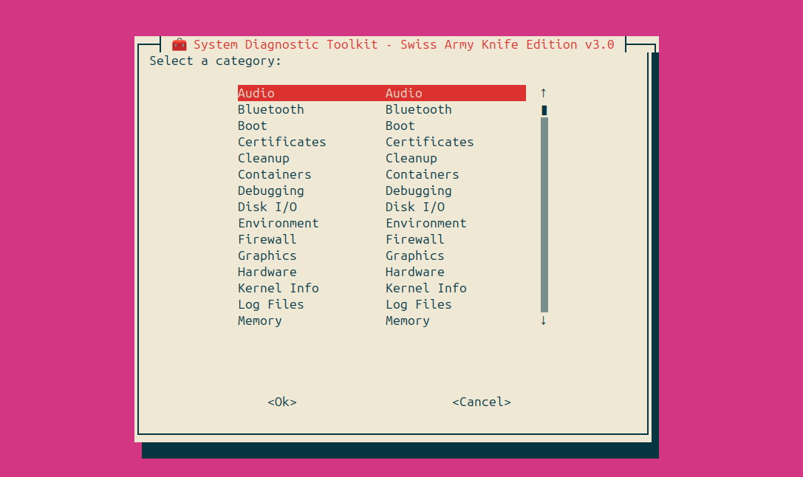

<p align="center">
  
</p>

<p align="center">
  
  
  
  
  
  
</p>


A modular, Bash power toolkit for Linux system diagnostics,admins, security auditing, and rapid incident response — built for sysadmins, security engineers, and DevSecOps teams.

> Part of the [GlobalCVE](https://github.com/globalcve) initiative to make open source gui security tooling accessible.
---

## 🚀 Features

- 🔍 **System Recon**: Kernel, CPU, memory, disk, uptime, users, and network info  
- 🧠 **Security Audit**: Firewall status, listening ports, failed logins, sudoers, SSH config  
- 📦 **Package & Service Check**: Installed packages, running services, cron jobs  
- 🧰 **Filesystem & Integrity**: Mounted volumes, SUID/SGID binaries, world-writable files  
- 🧪 **Live Diagnostics**: Top processes, open ports, DNS resolution, traceroute  
- 🧼 **Cleanup & Hardening Suggestions**: Detects risky configs and suggests remediation  
---

## 📦 Requirements

- ✅ Bash 4+
- ✅ Runs on Ubuntu/Debian (tested on 20.04+)
- Dependencies: whiptail, bash, coreutils, less - You will be prompted if other dependencies are needed for specific tasks.

---

## 🧑‍💻 Usage

```bash
chmod +x SWISS_ARMY_KNIFE.sh
sudo ./SWISS_ARMY_KNIFE.sh
```


## 📋 Output

- Generates a clean, timestamped report in terminal  
- Color-coded sections for readability  
- Ideal for copy-paste into incident reports or audit logs  



---

## 🧠 Why Use This?

- 🕵️‍♂️ Instant visibility into system health and security posture  
- 🧪 Great for triage, forensic snapshots, or post-breach analysis  
- 🧰 Perfect for air-gapped environments or minimal containers  
- 🧼 Helps harden systems with actionable insights  

## 🛠️ Roadmap

- [ ] Optional output to Markdown or HTML  
- [ ] Log file export  
- [ ] Integration with GlobalCVE CLI  
- [ ] Modular plugin system (e.g., `--network`, `--audit`, `--light`)  

## 🤝 Contributing

Pull requests welcome! Please follow the [GlobalCVE CONTRIBUTING.md](https://github.com/globalcve/globalcve/blob/main/CONTRIBUTING.md) guidelines.

---

## 📜 License

MIT — free to use, modify, and distribute.

## 🙌 Credits

Crafted with ❤️ by the [GlobalCVE](https://github.com/globalcve) community.

---

## 🖥️ Sample Output

```plaintext
[+] Hostname: ubuntu-dev
[+] Kernel: Linux 5.15.0-91-generic
[+] Uptime: 3 days, 4 hours
[+] Logged-in Users: 2
[+] Firewall Status: UFW enabled, 12 rules active
[+] Listening Ports: 22 (SSH), 80 (HTTP)
[+] Failed Login Attempts: 5 (last 24h)
[+] SUID Files: /usr/bin/passwd, /usr/bin/sudo
[+] World-Writable Files: /tmp/test.log
[+] SSH Config: PermitRootLogin no, PasswordAuthentication no 


